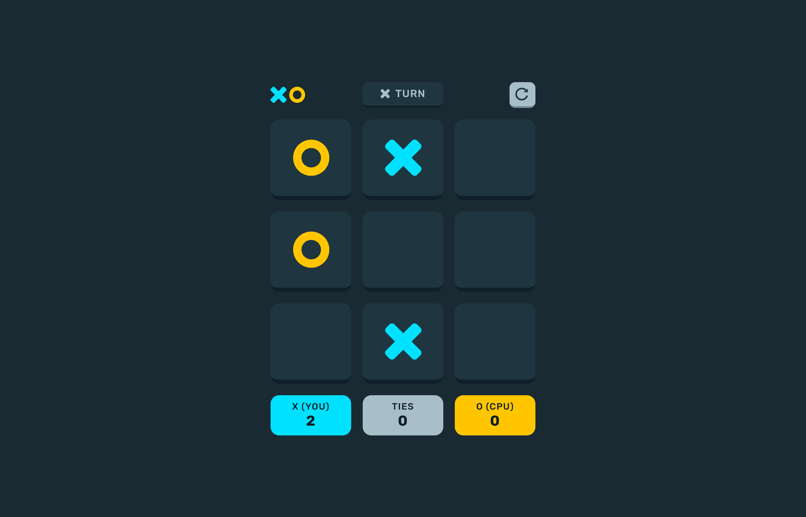
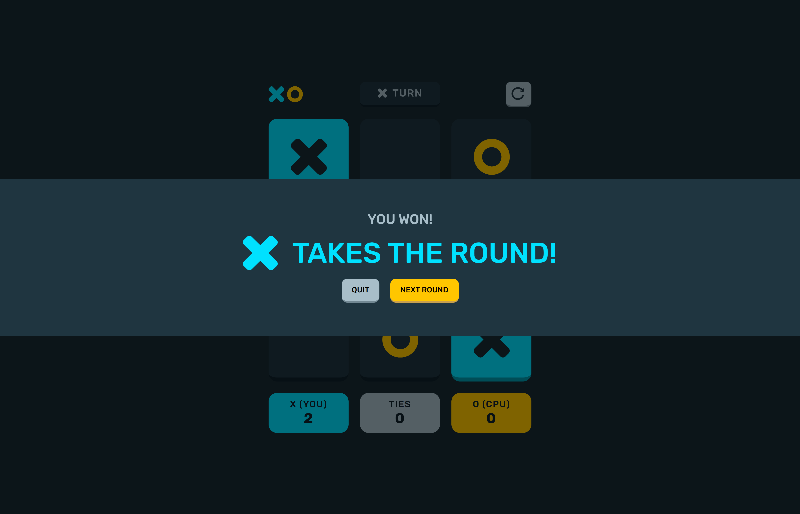
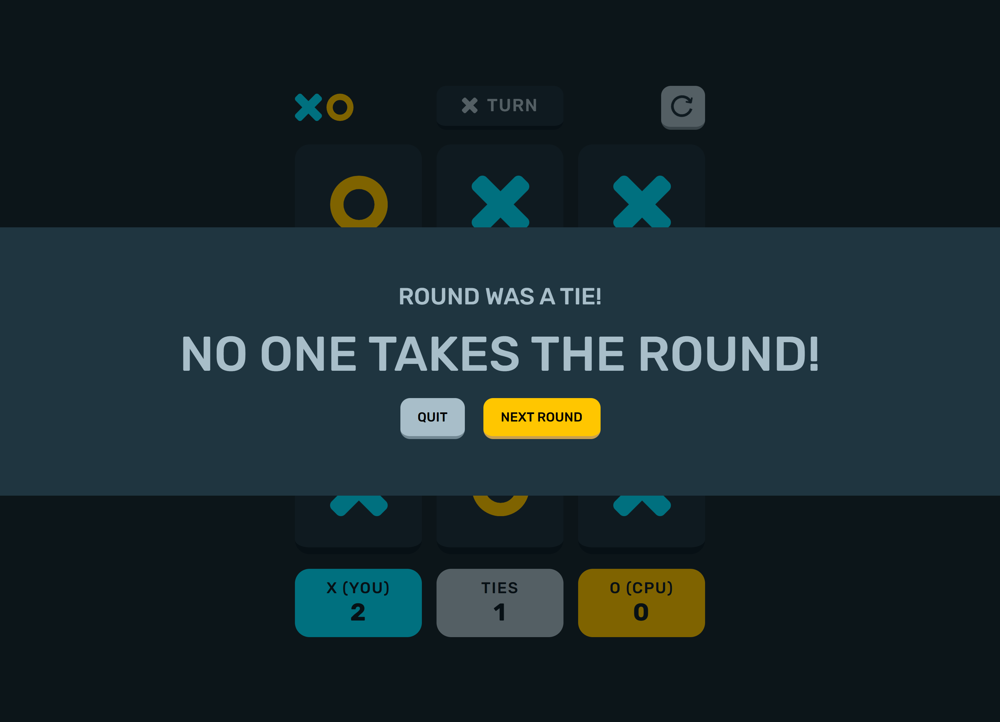
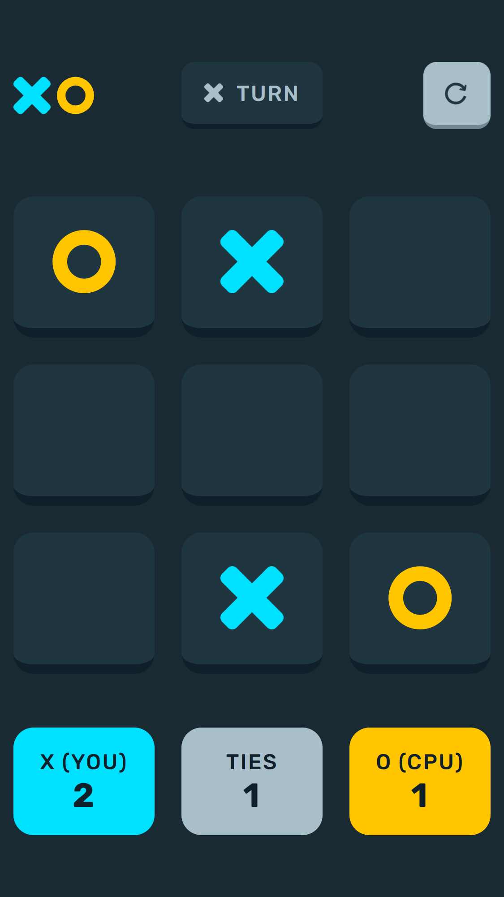
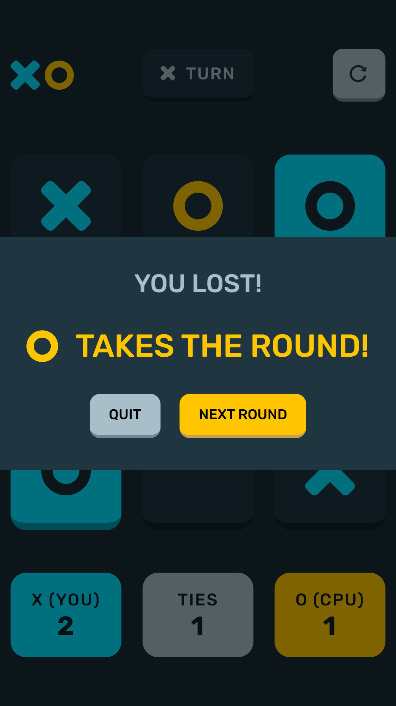

# Project Overview

## Table of contents

-  [Overview](#overview)
   -  [Features](#features)
   -  [Rules](#rules)
   -  [Screenshots](#screenshots)
   -  [Links](#links)

### Features

Users should be able to:

- View the optimal layout for the game depending on their device's screen size
- Play tic tac toe against the computer
- Maintain the game's score state after refreshing the browser
- Reset the score/board

### Rules

The rules of this tic tac toe game are simple. The user is presented with an empty 3 by 3 grid. The user will click on a cell in a grid to place an "X", attempting to get 3 cells with an "X" to match (horizontally, vertically, diagonally). Each time the user places an "X", the computer opponent will place an "O", also trying to get 3 in a row. Whoever gets 3 in a row first wins. If neither the player or computer opponent gets 3 in a row, the round is a draw. Winning a round gets you a point.

### Screenshots

***Desktop Layout*** (1440 X 900)\

***Tablet Layout*** (768 x 1024)\

***Mobile Layout*** (375 x 667) \

### Links

- Repository URL: [Github Respository](https://github.com/JasDhindsa/tictactoe)
