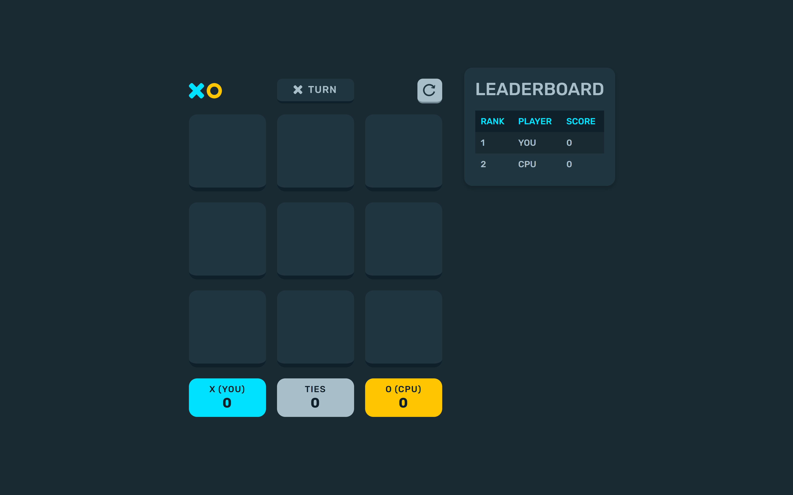
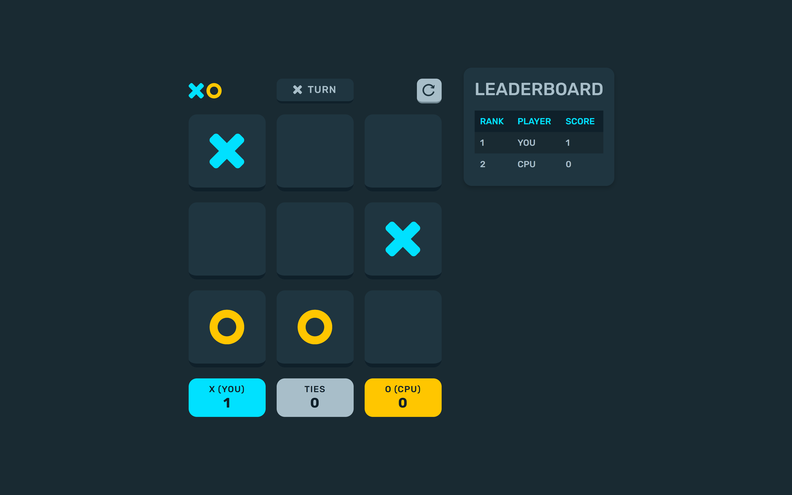
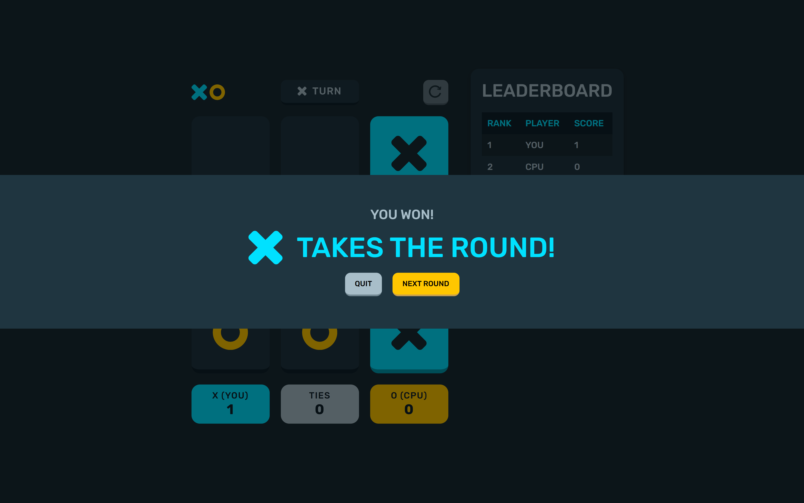
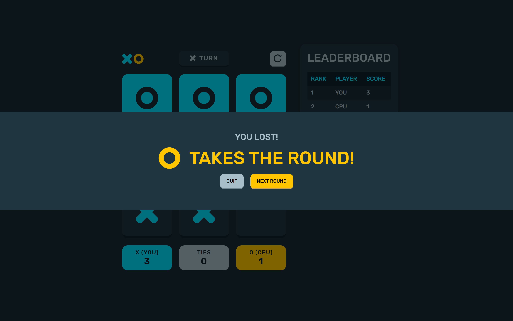
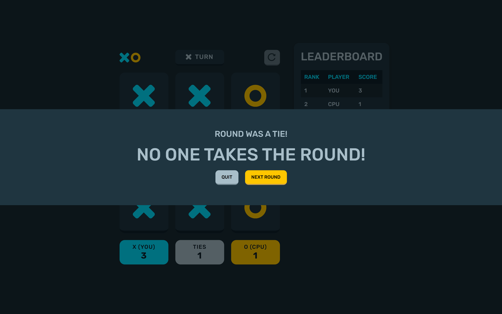

# Project Overview

## Table of contents

-  [Overview](#overview)
   -  [Features](#features)
   -  [Rules](#rules)
   -  [Screenshots](#screenshots)
   -  [Links](#links)
   - [How to Run the Code](#how-to-run-the-code)


### How to Run the Code

1. **Start the PHP Server**: Navigate the file directory (not the php folder) and start the PHP server:
    ```bash
    php -S localhost:8000
    ```
2. **Open in Browser**: Open `http://localhost:8000` in your browser.
3. **Check the Console**: Check the browser console for any errors.
4. **Verify Endpoints**: Test the endpoints directly in the browser:
    - `http://localhost:8000/php/server.php/scores`
    - `http://localhost:8000/php/server.php/leaderboard`
    - `http://localhost:8000/php/server.php/reset` (POST request)

### Features

Users should be able to:

- View the optimal layout for the game depending on their device's screen size
- Play tic tac toe against the computer
- Maintain the game's score state after refreshing the browser
- Reset the score/board

### Rules

The rules of this tic tac toe game are simple. The user is presented with an empty 3 by 3 grid. The user will click on a cell in a grid to place an "X", attempting to get 3 cells with an "X" to match (horizontally, vertically, diagonally). Each time the user places an "X", the computer opponent will place an "O", also trying to get 3 in a row. Whoever gets 3 in a row first wins. If neither the player or computer opponent gets 3 in a row, the round is a draw. Winning a round gets you a point.

### Screenshots

***Desktop Layout*** (1440 X 900)\






### Links

- Repository URL: [Github Respository](https://github.com/jordan-na/tictactoe_php)
